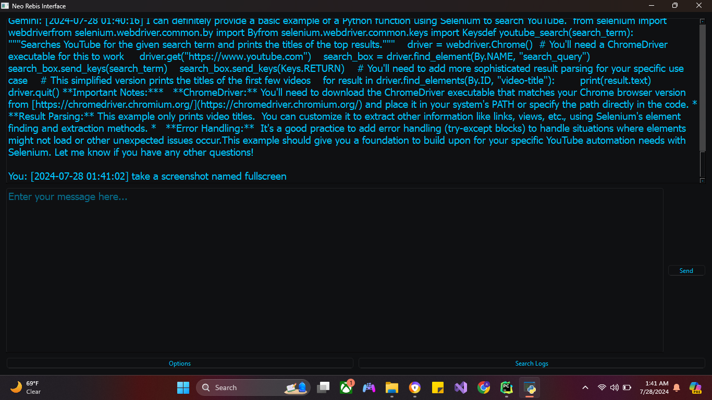
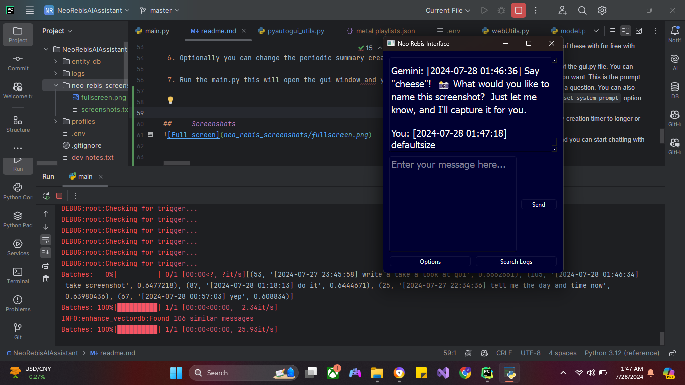
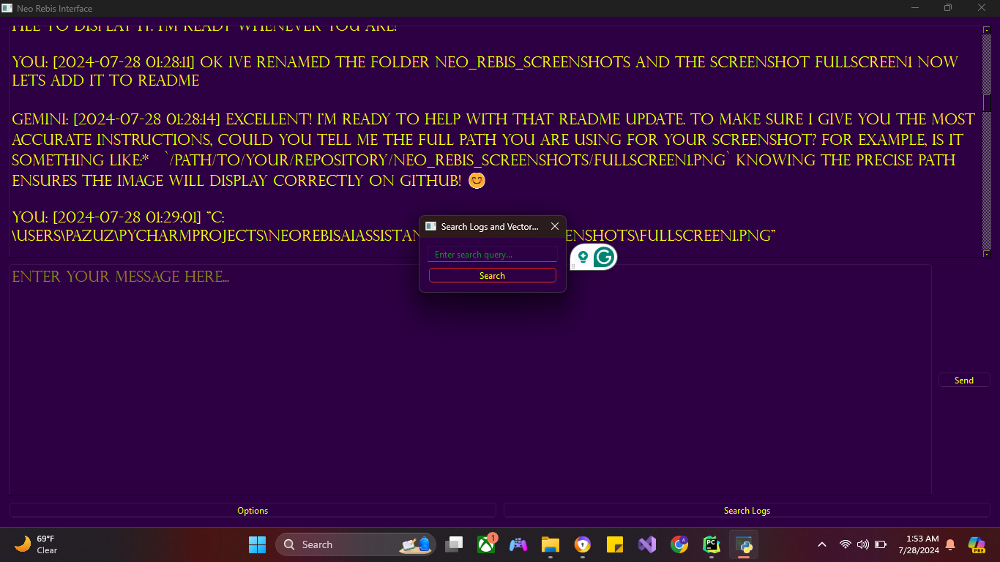
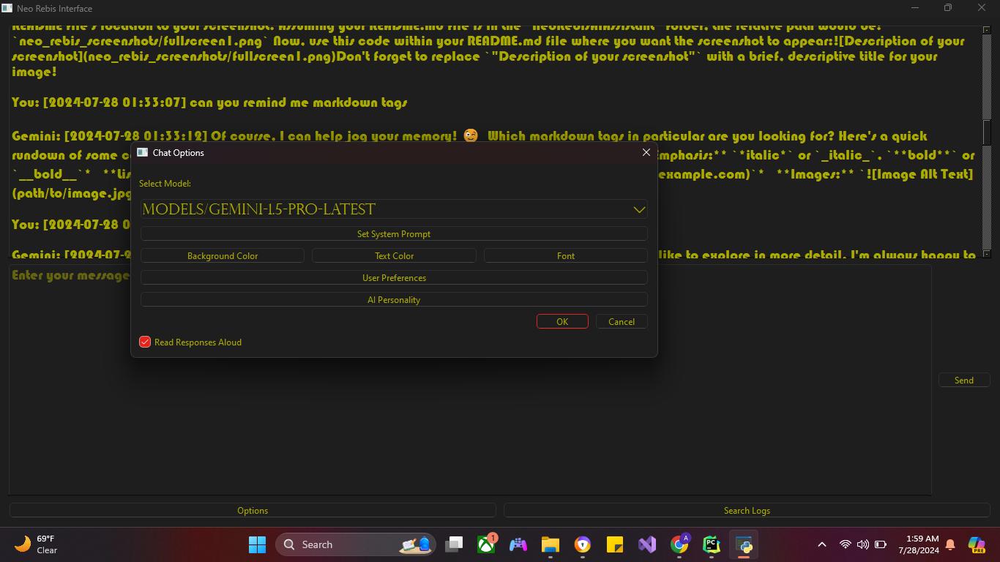
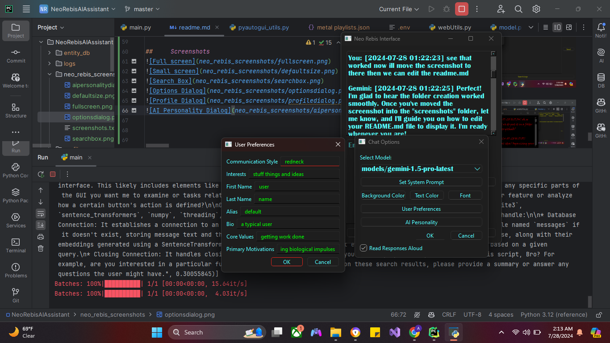
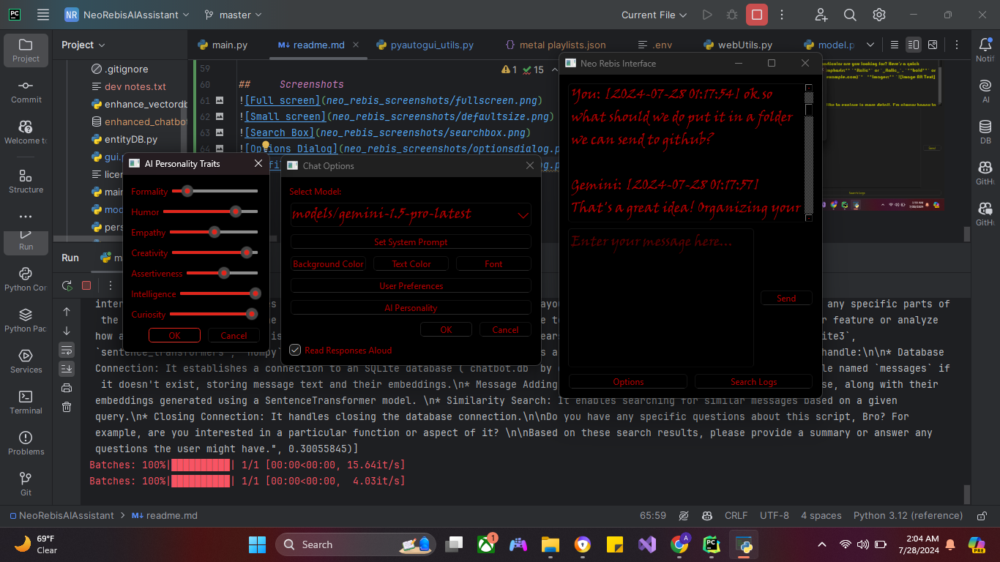
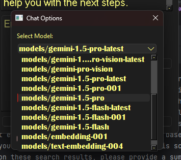
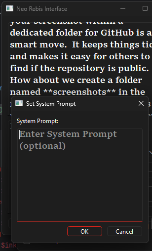

# Neo Rebis Chatbot App

This is a chat app designed with the goal of being a real personalized AI assistant. It features a simple and intuitive design, making it easy to navigate and use. You can easily switch between chats, manage contacts, and access settings.  

The app offers features like:

* PyQt6 GUI with font and color customization
* Automatic chat log creation for later reference
* Vectorization by sentence transformers and local database storage with SQLite
* User and bot initiated local search for refreshing the bots memory
* Periodic summarization of chat logs and autoloading of the latest summary on startup
* User profile creation to get more personalized responses from the AI
* Gemini model selection and on the fly model switching
* On the fly temporary System Prompt switching to suit any new needs you may encounter in the chat.
* AI personality trait slider system to adjust the AI's personality to your liking
* Several AI function calls allow the bot to perform a variety of tasks such as: 
   * text file creation, editing, and reading and directory reading. 
   * Tavily search for which feeds it summarized info from the web. 
   * It also can manage its own Entity database and can be asked to search for entities database of json files for later use. I personally use this to store youtube links which it can then retrieve and open in a browser by conversational context. By default the script will generate an html file from any website you have the bot open in a browser. This can be disabled by commenting out the lines in the surf_web function in the utils module.
   * Local semantic search of the vectorized messages and summaries.
   * Open a browser to a website of your choice.
   * Open a google search of your choice.
  


We are still in development with many features to add and, but we hope this app will turn the gemini llm into a versatile and powerful AI assistant.


 ## Getting Started
 \
 To use the Neo Rebis chat app, you'll need to follow these instructions: 
 
 1. **Clone the Repo:**  Start by cloning the repository from [GitHub link].

 2. **Install Dependencies:**  Next, you'll need to install the required dependencies.  You can do this by running the following command in your terminal: 
     ```
     pip install -r requirements.txt
     ```
     This will install all the required dependencies for the app to run.

 3. Create a new virtual environment and activate it.  You can do this by running the following commands in your terminal:
     ```
     python -m venv venv
     venv\Scripts\activate
     ```
     This will create a new virtual environment and activate it.  You'll need to activate the virtual environment every time you want to run the app.  You can deactivate the virtual environment by running `deactivate` in the terminal.

 4. Set up your API keys.  You'll need to create a new `.env` file in the project directory.  Add your Gemini API key asAPI_KEY=yourapikeyhere and your Tavily api key as TAVILY_API_KEY=yourtavilykeyhere.  You can get your Gemini API key from [Gemini's API Docs website](https://ai.google.dev/gemini-api/docs/api-key).  You can get your Tavily API key from [Tavily's website](https://www.tavily.com/).  You'll need to sign up for an account on both websites to get your API keys.  You can get both of these with for free with mild usage limits.

 5. Edit the default system prompt in the App class of the gui.py file.  You can change the default system prompt to whatever you want.  This is the prompt that the AI will use when it needs to ask the user a question.  You can also change the default system prompt by using the `set system prompt` option from the options in the chat window.

 6. Optionally you can change the periodic summary creation timer to longer or shorter in the App class

 7. Run the main.py this will open the gui window and you can start chatting with the AI.  


##     Screenshots










 

 

 
 